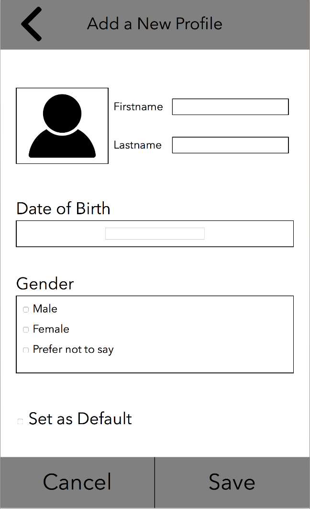
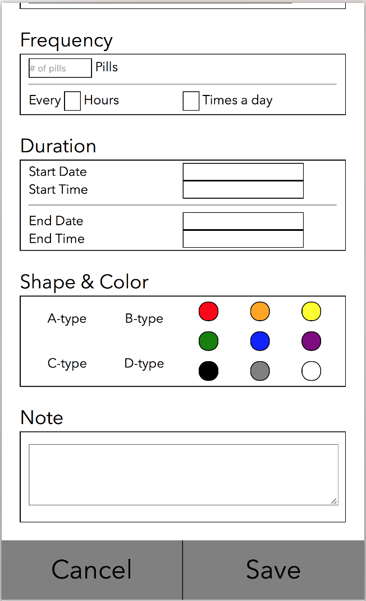
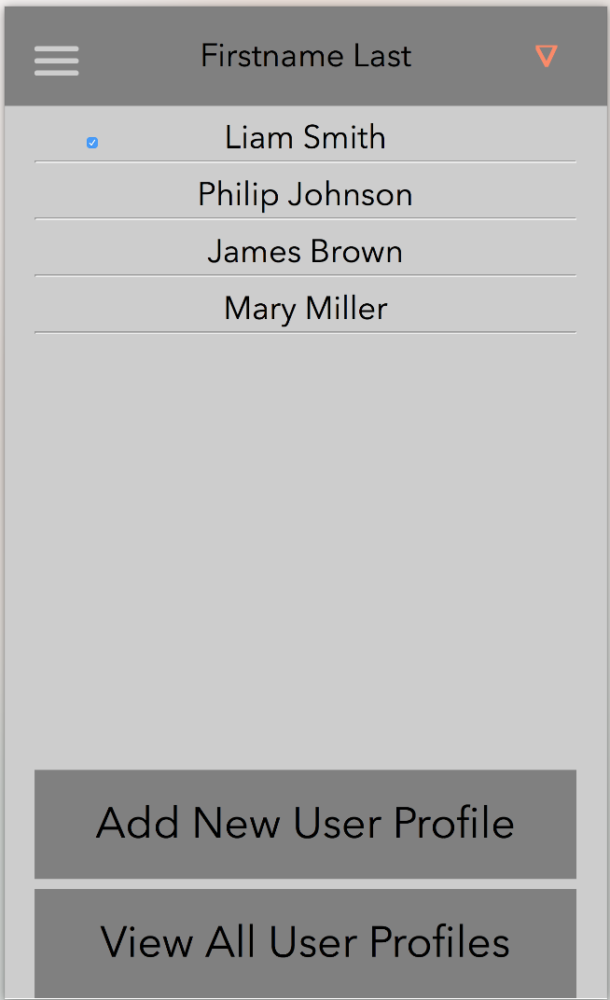
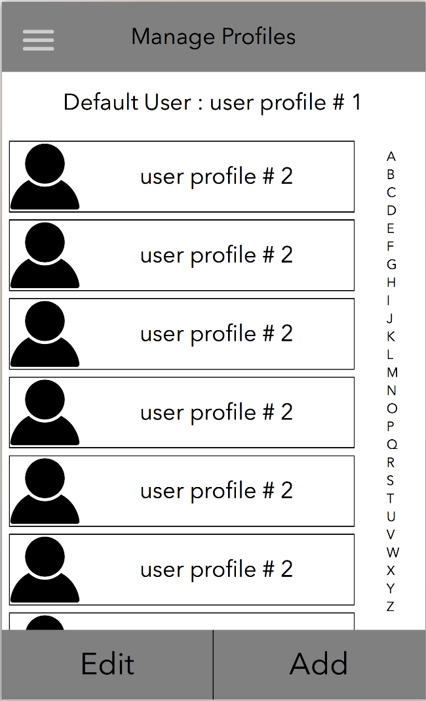
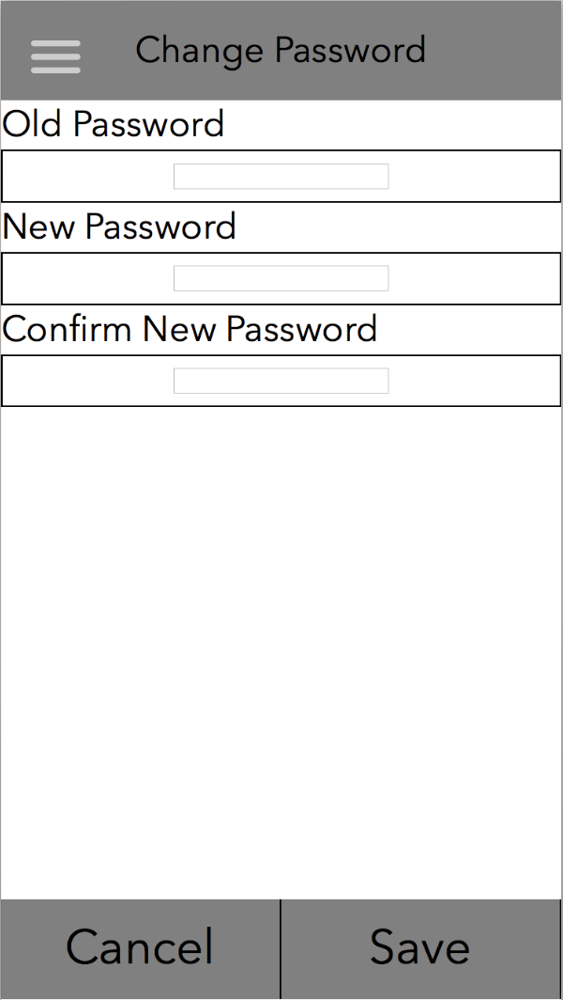

- For milestone4, we have improved the UI/UX design by making the layouts more user-friendly and intuitive. Overall, we have changed the spacing on the pages for a cleaner look, and have created textboxes with borders to differentiate them from titles/labels. These textboxes act as a guide for users to help them quickly acertain what type of information they need to fill out. Furthermore, we fleshed out the UI skeleton more by filling out all the pages with their corresponding information. We included more details in the settings and help pages, and added a login and sign-up page to our app as well.
- In order to protect our users and their information, we want to have users create private accounts tied to their emails. We do not plan on allowing users to access or share another user's personal or medication history. The information that we collect from users are primarily used for identification purposes, age restrictions on consent or other legality issues, and potential medicial properties. The profiles each user creates are accessible only by them, and all the data associated with those profiles also fall under that specific user's domain. Through the settings page, we will provide more details to users about what we do with the information they provide to us. They will also have the option to delete their account, and permanently destroy any information tied to their accounts on the app. We hope to ensure users that their information is safe, and that we value their privacy. 
- UI Screenshots:

