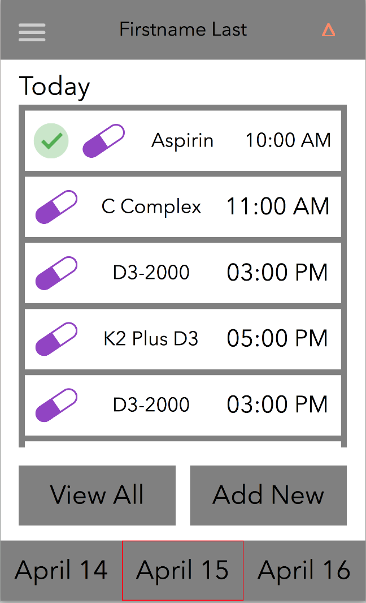
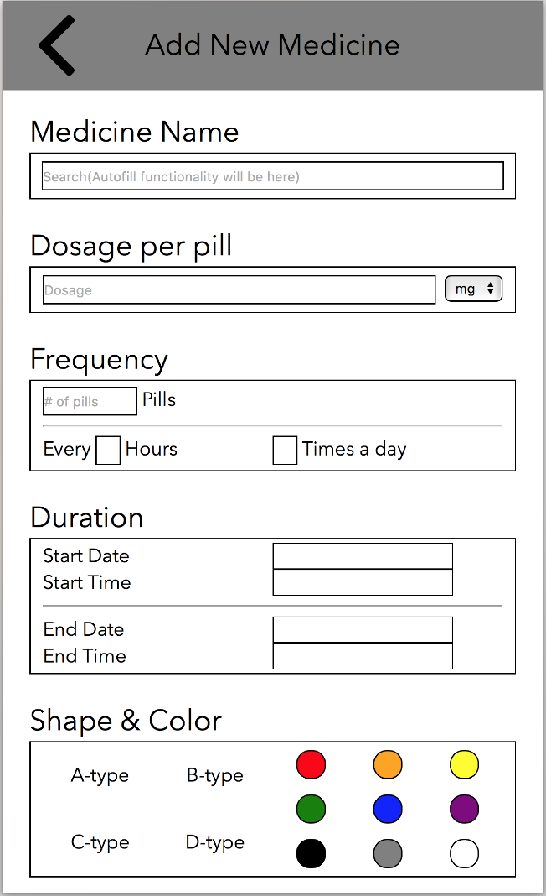
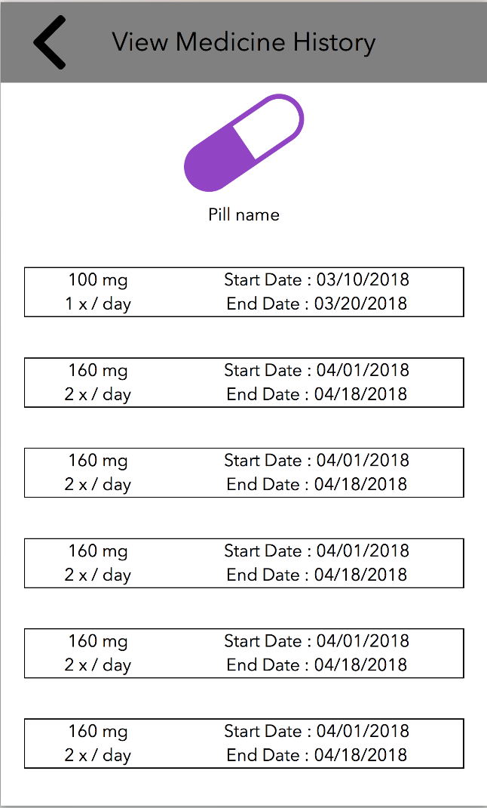
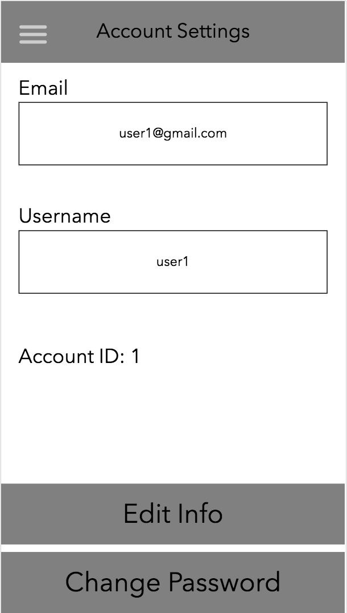
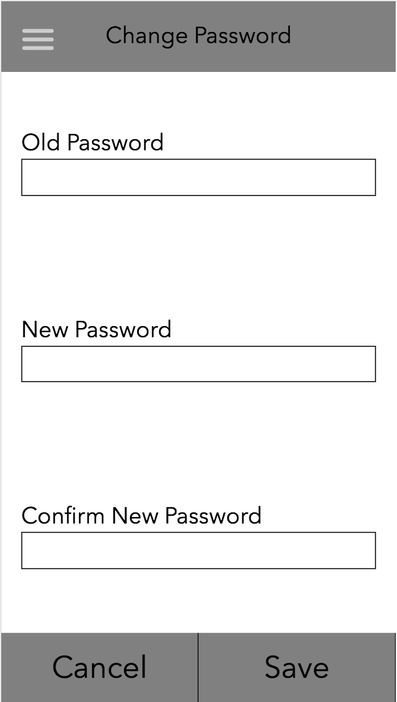

RUBRIC:

1. milestone5.md is present in your project's GitHub repository.
2. milestone5.md contains screenshots of your latest UI webpages embedded directly within the file.
3. milestone5.md contains a written explanation of how your UI's screenshots have improved upon the 
versions shown in milestone4.md.

Our UI is quite similar to the version shown in milestone4 because we worked on the UI a lot previously, and we plan on sticking with overall skeleton. While milestone4's UI was entirely hardcoded and based on fake data, this UI is dynamic and is based on information we fetch from the database, so I guess you can say this our biggest improvement. Since milestone4, we mostly worked on the backend functionaliies of the program to connect with the database and display the correct information. 

4. milestone5.md contains a written description of at least two non-trivial actions that users can perform when they use your app. These should not be simply logging in or opening static webpages; they need to be substantive actions that demonstrate your app's core functionality, and also differ from one another in a significant way (2 points).

Action 1: 

note: we structured our database as a REST api, so all of the requests to the database will have pathnames of /api/*

Description: Switching between profiles. When you arrive at the home page, the page will initially display today's medication list for the current profile (more on this later). If you click on the drop down menu on top right (the orange-ish triangle thing), you'll bring down menu with list of all profiles. Clicking on any of them will bring up information about their medication for the day. 

Implementation: Among others, each profile in our database also have two other boolean properties: default and current. When you view a profile, such as by clicking the drop down menu like described above, we do a db search to fetch the appropriate profile. Once fetched, if the "current" boolean for the fetched profile isn't alread set to true, we go through ALL of profiles within that account to find the current profile, set that profile's "current" boolean to false, and set the fetched profile's "current" boolean to true. After the boolean has been set and profile fetched, we go through the medicine db and find the profile's medication for the day.

When user gets to the home page, we automatically display the information of the current profile. If the user just logged in, we will show default profile instead.

Our call to database for renering this page occurs in both backend and frontend. When clicking on home or from log-in page, we make a request to fetch current profile from the route file and render the page with information from handlebars. Once the page is loaded, we make an ajax request on the frontend to fetch ALL profiles and display them in the drop down menu. This is done to reduce the amount of time users have to wait for the page to load.

So overall, all of this makes three total requests to the database: 
1) GET /api/profiles/current (get current profile) 
2) GET /api/profiles/:profile_id (get selected profile) 
3) GET /api/profiles (get all profiles for the current account). 

The first two requests also utilize a middleware; after fetching the desired profile, they call a function to fetch all of that profile's medication for the day. 

Action 2:

Description: Adding, editing, and deleting profile. Clicking on the navigation bar on the top left and then "Manage Profiles" will bring you to the /viewProfiles page which displays all of that account's profiles. This page will show the default profile at the top and other profiles below it. At the bottom, there are "add" and "edit" buttons (the edit button doesn't work in this page just yet; to edit, you have to first select the profile and then click edit). Here are the functionalities you can do:
1) Click "add" button to add new profile, which will be displayed on the page after adding. 
Clicking on a profile will bring you to /viewProfile page that shows the selected profile's information. This leads to the next two functionalities:
2) Clicking "edit" will give you the option to edit all of the information displayed on that page
3) Clicking "delete" will delete the profile from the database and returns you to /viewProfiles page

Implementation: This is technically 3 distinct functionalities, but I'll include them all as 1 functionality under "profile management", so technically we have 4 non-trivial tasks :)

1) Editing profile. This is perhaps the trickiest and most time consuming one to implement. After user clicks "save", we had to check which of the fields, if any, were modified. The ones that were modified get added to the json object and we make a PATCH request to /api/profiles/edit/:profile_id. The trickiest part happens in the database: since we don't know how many columns the user wants to edit, we cannot simply have a default query string for updating. Thus, the query string was constructed by looping through all of the values passed into the request body and concatenating it to the query string. Once constructed, we make a db call to edit the profile and return appropriate response.

2) Adding profile. After user enters the information and presses save, we put all of that information inside of an object and make a POST request to /api/profiles/new to create new profile in the database. When creating the profile, we also need to make sure we create it under the correct account. The information about account id is already listed in the JWT token we used for authorization.

3) Deleting profile. We haven't implemented a "are you sure you want to delete this profile" warning message yet, but the overall function is completed. Clicking delete will make a DELETE request to /api/profiles/delete/:profile_id that will delete the profile from the database AND all of that profile's medication.
____

5. For User Action 1 described in milestone5.md, your TA is able to successfully perform that action in your app during your grading session just by reading your written description (2 points; you get 1 point if they have a lot of trouble and you need to help them out).
6. For User Action 1, you can convince your TA that it is part of your app's core functionality.
7. For User Action 1, you are able to explain the actual code you wrote to implement that action.
8. For User Action 1, you can convince your TA that it was non-trivial to implement (e.g., not simply putting a link on a webpage).
9. For User Action 2 described in milestone5.md, your TA is able to successfully perform that action in your app during your grading session just by reading your written description (2 points; you get 1 point if they have a lot of trouble and you need to help them out).
10. For User Action 2, you can convince your TA that it is part of your app's core functionality.
11. For User Action 2, you are able to explain the actual code you wrote to implement that action.
12. For User Action 2, you can convince your TA that it was non-trivial to implement (e.g., not simply putting a link on a webpage).

