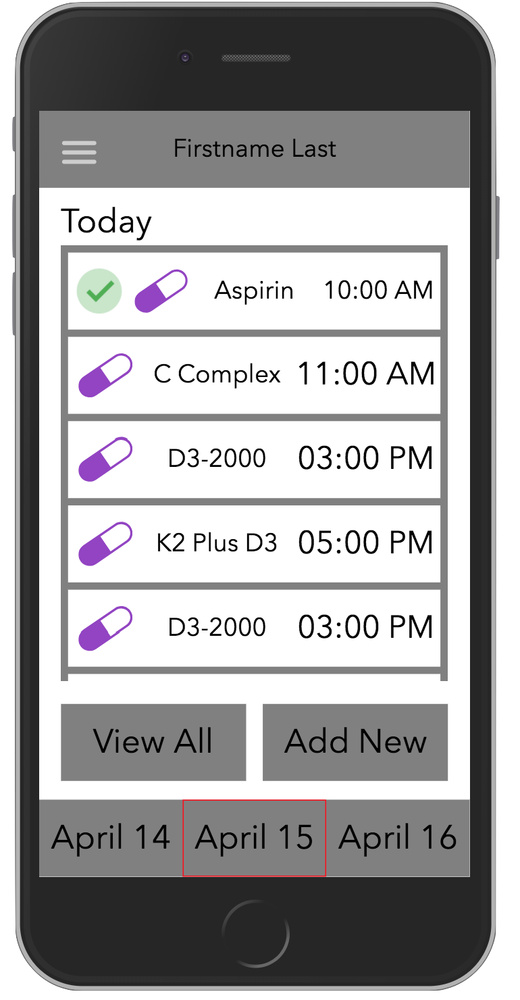
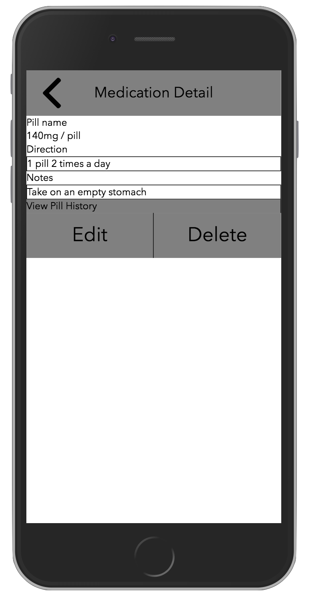
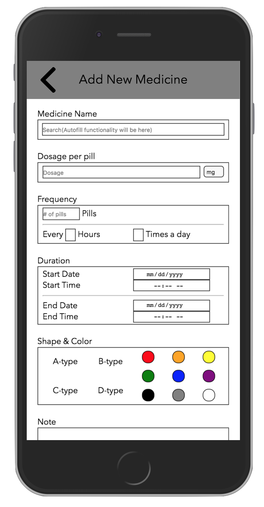
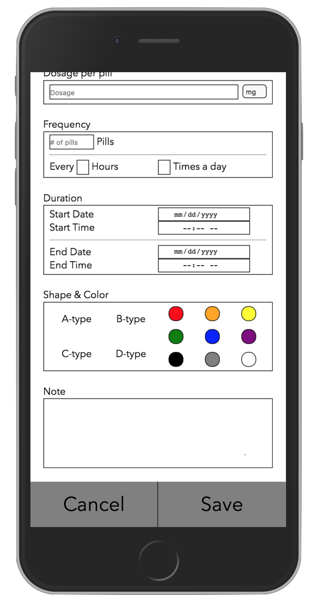
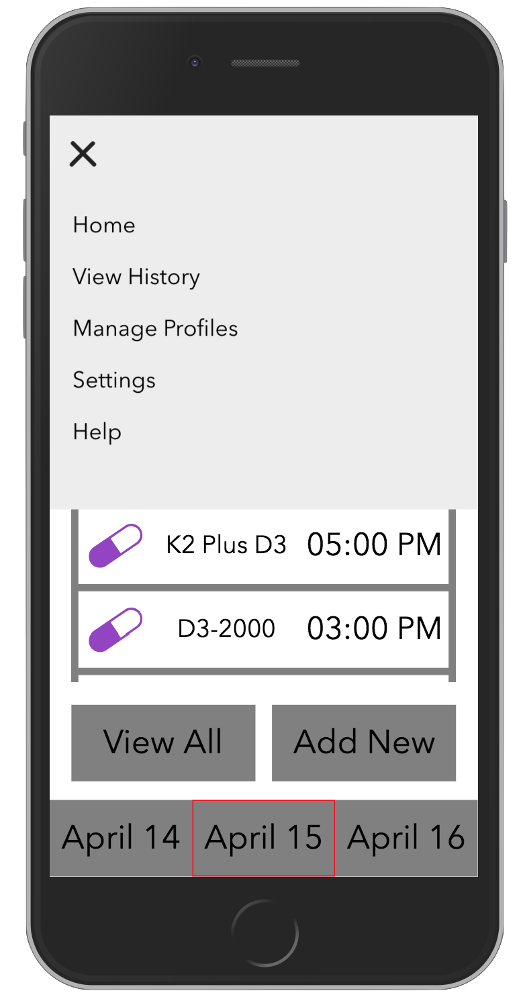
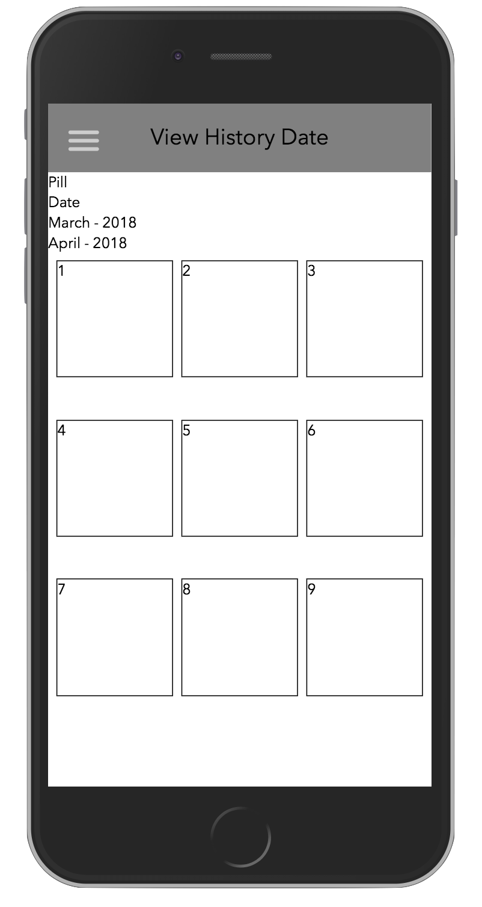
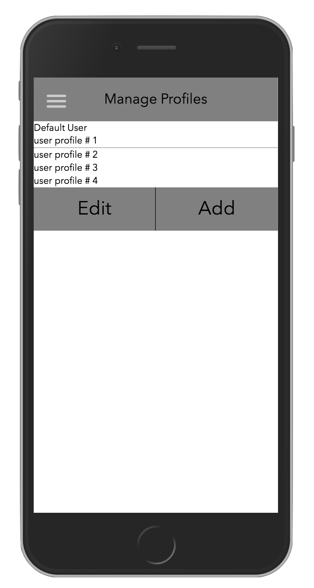
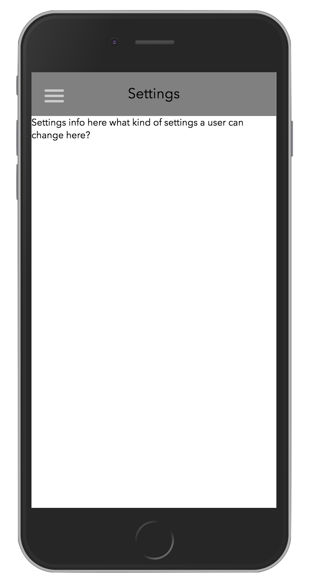

Our web app has been modified to include features from both of our prototypes. For our homepage, which displays the user's upcoming medication, we wanted to keep the yesterday-today-tomorrow bar at the bottom for the User's easy access to recent medication, but also make switching profiles convenient. Therefore, we added a "manage profiles" page to the navigation bar where the user can see who the default profile is and what other profiles there are. For the medication history, we decided to add an option where users can check their history by looking at it from a list format, or by a calendar format. For the list format, they can click on a specific pill to see when they have taken it. The calendar format is the same as the history option from Prototype-1. This dual option allows users to see all the medications they have taken in the past without going through their entire calendar, or on what days they have taken certain medications. From the homepage, users can also click on one of their upcoming medications and see all the pill's information. For convenience, we added a button where users can click it to directly view that pill history directly as well. 
We plan to use an API from https://mor.nlm.nih.gov/download/rxnav/APIsOverview.html for auto-filling medicine names when adding new medications.

