- UI Improvement:

In milestone 6, we have added our medication icons so users are now able to customize their pills' appearances. This UI allows users to quickly recognize what medication they have through a visual queue.

Furthermore, we have restructured the medication history page such that it shows all the medication in a date-organized list depending on which profile the user selects to view. Before this, while we did show a list of medication, we simply showed ALL medications and used a hardcoded time. With this milestone, all medication history are sorted by date and time, and only the relavant ones are shown to the user on home page. We have also changed the pill history such that when you select a specific pill, it will display whether that profile has taken the pill, and when they took it.

At this point in time--unless I missed something while going over the code--we should not have any hardcoded data in our UI. Everything, starting from the current dates to the relevant medication are all generated based on real time data and data from the database.

- Explanation of data visualization:

(Data visualization Screenshot: Medication History)
In high level language: For our data visualization, we are displaying a profile's medication history. This visualization is the result of an internal function that generates data based on a user's input in the backend, and then updates the frontend's visuals with that new information. In other words, a user can add a new medication for a profile, which will cause our function to pull that information and update the profile's medication history to show that new medication.

TL;DR: home page will display all medication you have to take for the day. Adding new medication will create a history of it in backend and determine how many times you need to be reminded to take it.
--

In low level language: we have 2 tables that store information about medication: medication table and history table. 
The medication table contains all medicine and all information associated with it (ex. name, shape, consumption frequency, etc.). 
The history table will contain multiple entries of the same medication, but at different dates and time. For example, if medication "A" is created with the following key informations: start_date = May 30 & times_per_day = 4, then 4 entries of this medication will be created in the history table, each one having different consumption time.
--

Data visualization screenshot examples
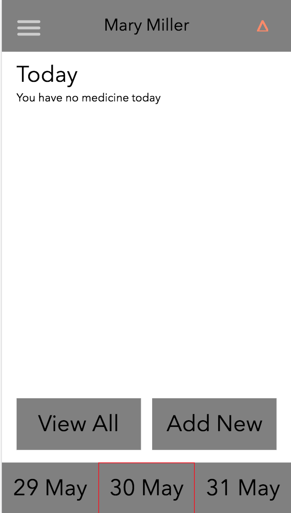

^ As you can see, this is the current home page for this profile. The profile doesn't have any medication to take on this date, and thus nothing shows up. 

^ Here is what the profile's current medication looks like. As all of these medications are to be taken on different days, nothing is shown on the home page.

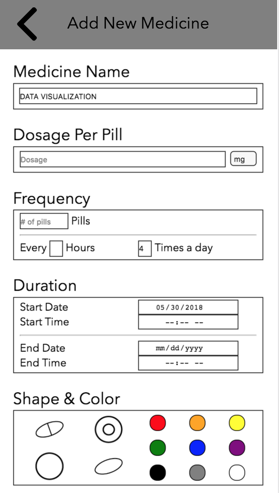

^ Here, the medication is being added. Pay attention to the start date and times per day inputted. This particular medication will be taken 4 times on May 30th.

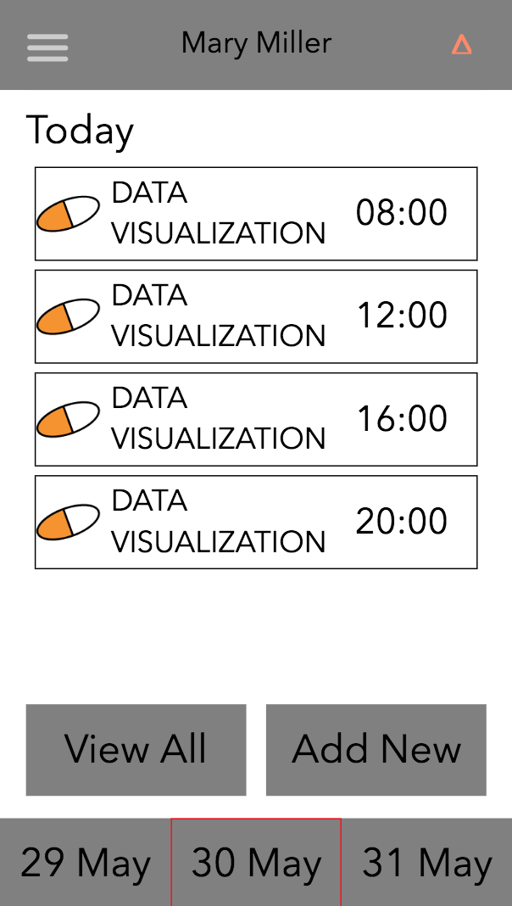

^ After adding the medication, the backend creates 4 entries to insert into the history table. Notice that the timing of the medication are all different. 

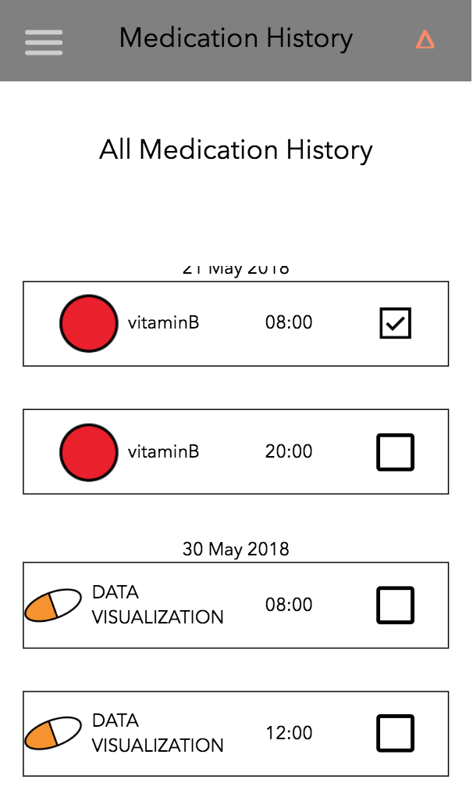

^ The profile's history is of course updated to reflect this new medication. The list comes nicely sorted.

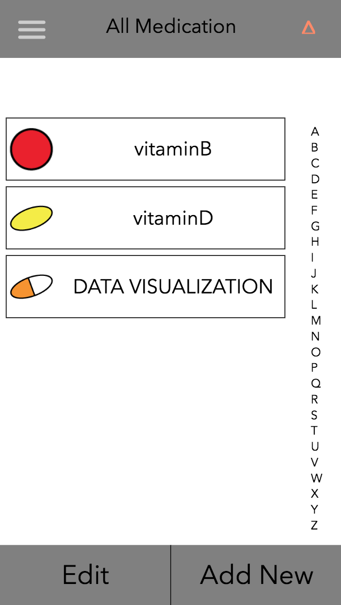

^ Another neat thing to note is that there is only one medicine added to total list. While there are 4 history/notifications of the medicine added, there is only 1 medicine added to the medication list. 

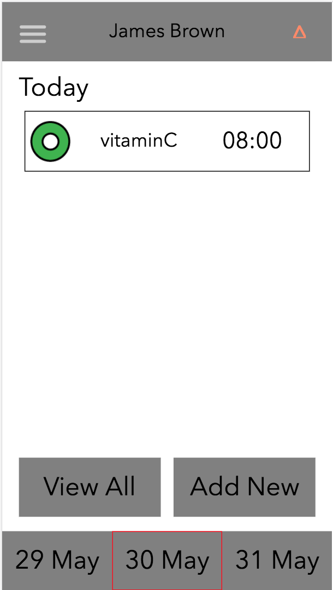

^ As mentioned above, the homepage will only display relevant information. By default, the view is set to today. This is indicated by the red square box at the bottom and by the text at top. However, users can also choose to switch views and see medication for either the previous day or the next day, as seen below.

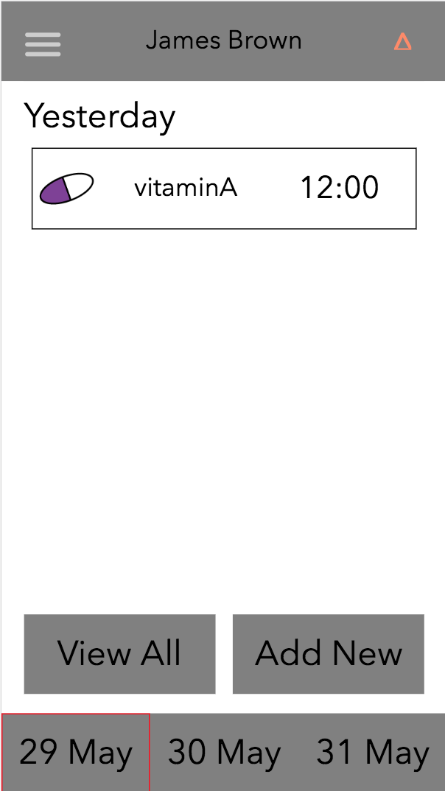

^ Yesterday medication

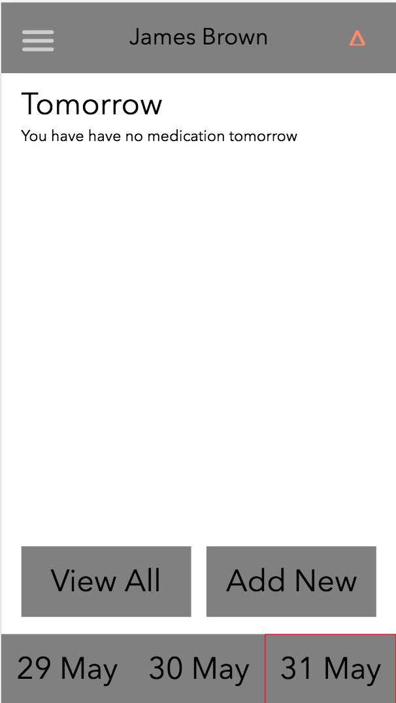

^ Tomorrow medication

- Screenshots:

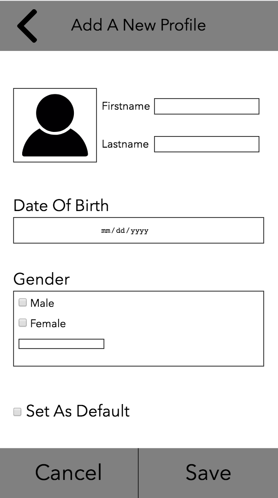
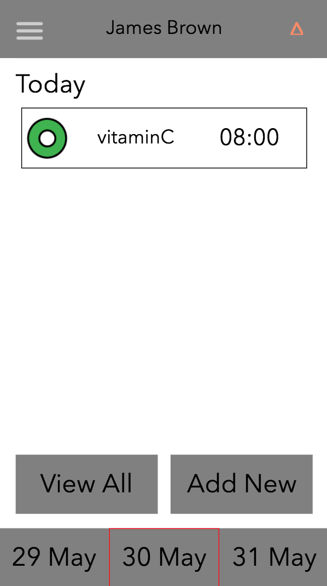
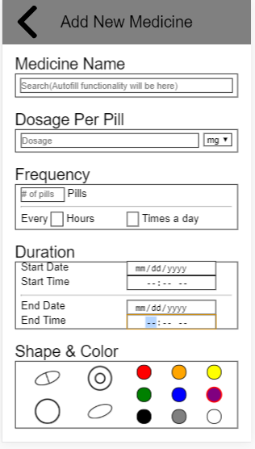
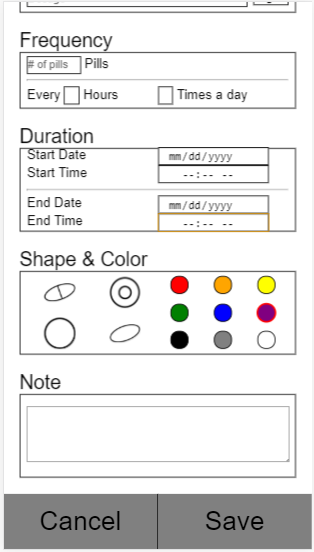
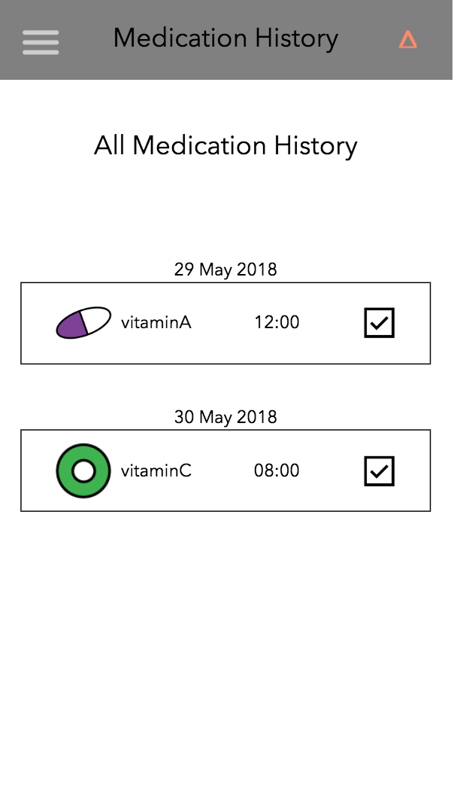
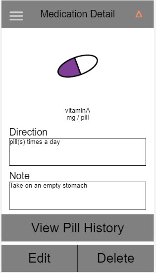
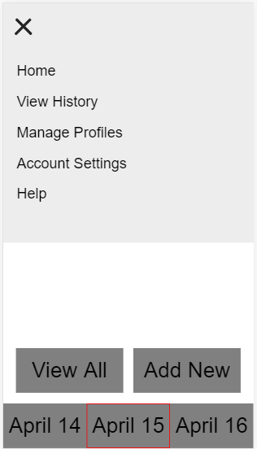
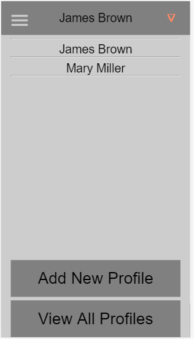

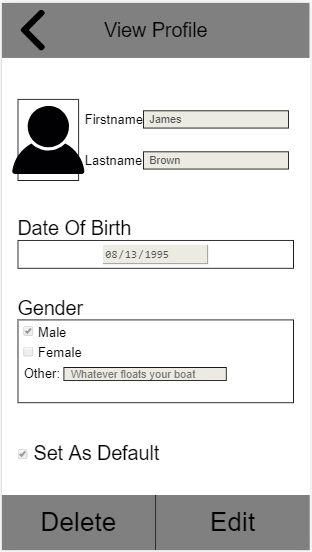
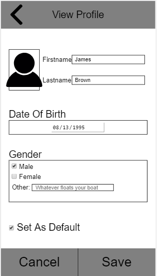
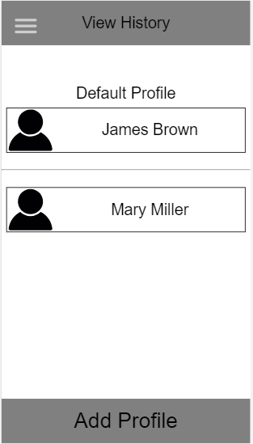
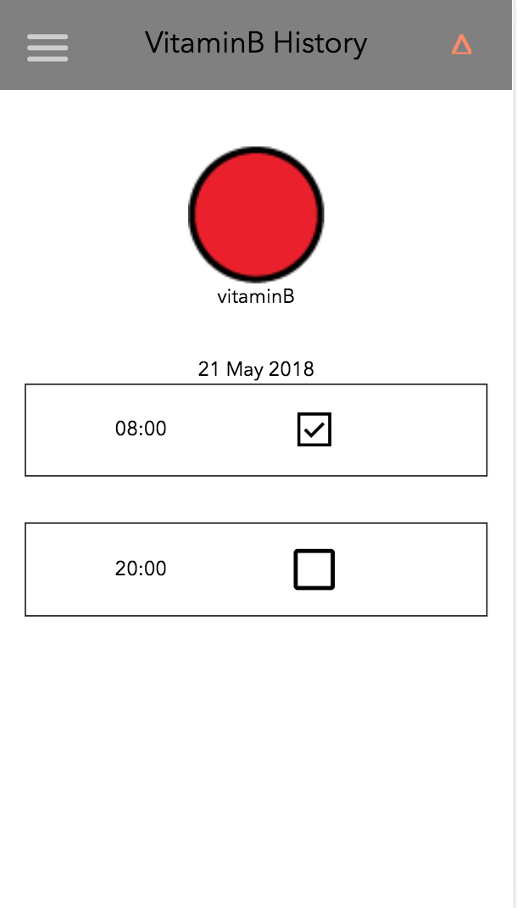
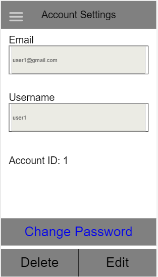
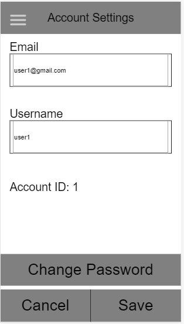
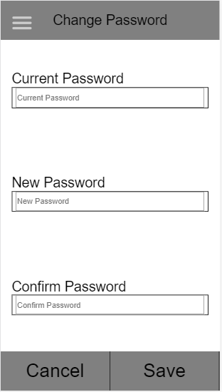
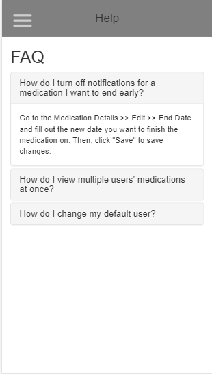

